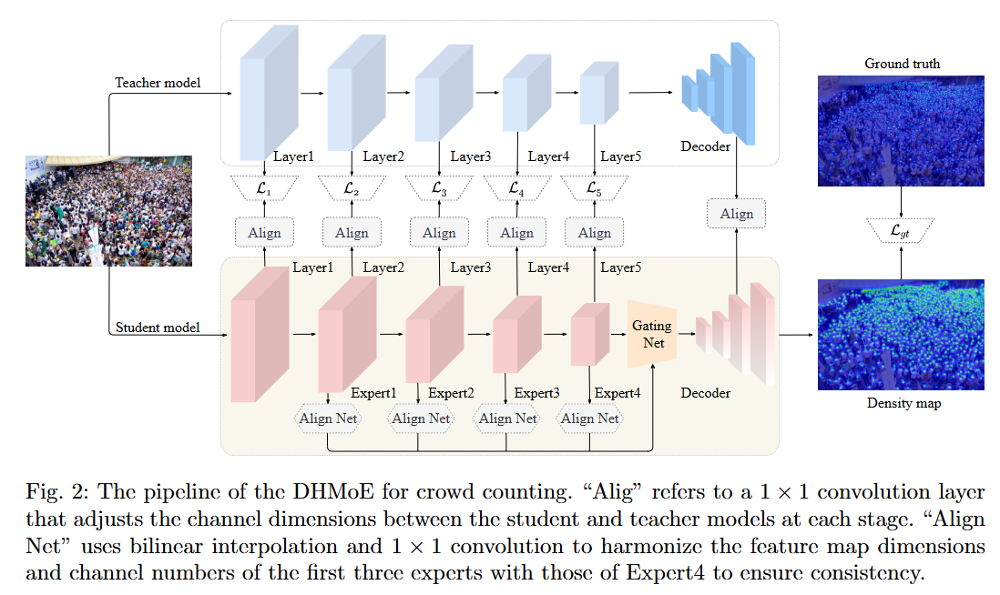
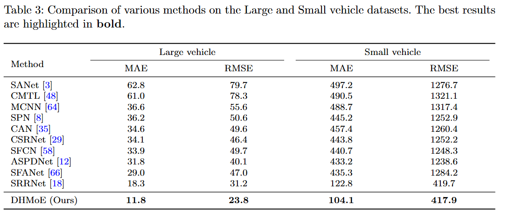
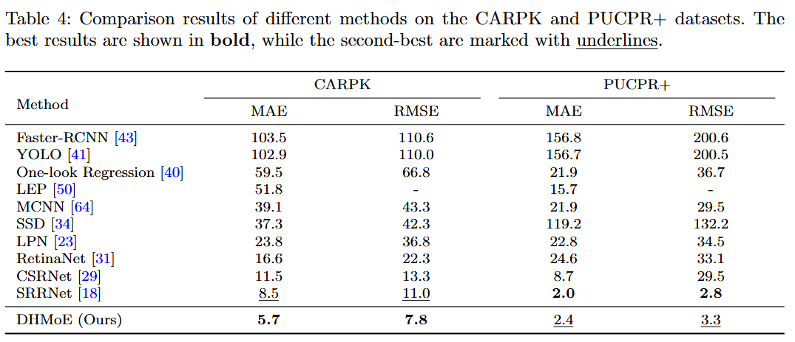
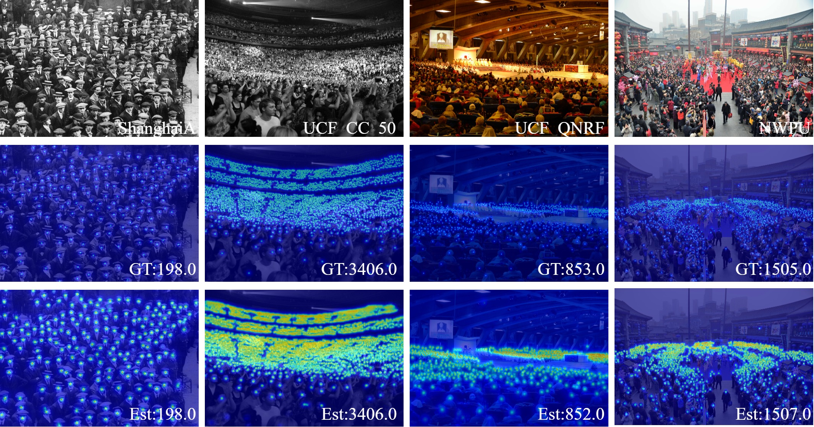
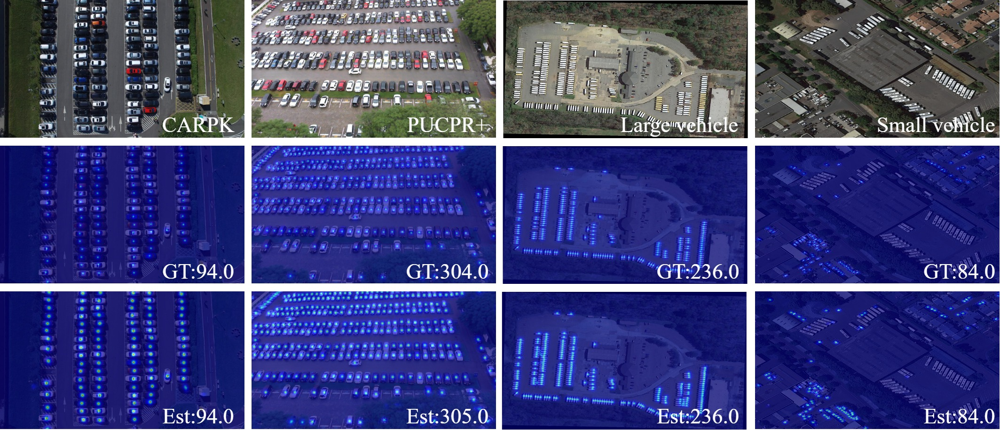

# Towards Trustworthy Crowd Counting by Distillation Hierarchical Mixture of Experts for Edge-based Cluster Computing

This repository contains the code and resources associated with our paper titled "Towards Trustworthy Crowd Counting by Distillation Hierarchical Mixture of Experts for Edge-based Cluster Computing". Please note that the paper is currently under review for publication.

The code is tested on Ubuntu 22.04 environment (Python3.8.18, PyTorch1.10.0) with an NVIDIA GeForce RTX 3080 Ti.

## Contents

- [Towards Trustworthy Crowd Counting by Distillation Hierarchical Mixture of Experts for Edge-based Cluster Computing](#towards-zero-shot-object-counting-via-deep-spatial-prior-cross-modality-fusion)
  <!-- - [Contents](#contents) -->
  - [Introduction](#introduction)
  - [Train](#train)
  - [Test](#test)
  - [Pretrained Weights](#pretrained-weights)
  - [Results](#results)
    - [Quantitative Results](#quantitative-results)
    - [Visual Results](#visual-results)
  - [Citation](#citation)
  - [Acknowledgements](#acknowledgements)

## Introduction

To address the challenge of lightweight crowd counting in complex scenarios, we propose the Distilled Hierarchical Mixture of Experts Network (DHMoE). As illustrated in the figure, the network consists of a teacher model (OSNet 1.0×), a student model (OSNet 0.5×), along with the corresponding decoder and hierarchical mixture of experts network. The teacher model typically has a larger number of parameters and is pretrained. In contrast, the student model has fewer parameters and primarily learns under the guidance of the teacher model. Additionally, a Mixture of Experts (MoE) network is employed to assist the student model in acquiring deep knowledge from the teacher model. The decoder restores the predicted density map to its original input size through a series of deconvolution operations.



## Train
The training code will be released after the acceptance of this paper
1. Prepare the datasets used in the experiment.
2. Modify the data set address in `make_npydata.py` to generate the correct dataset information
3. Modify the dataset, save_path and other options in `config.py`.
4. To ensure compatibility with the selected dataset, it is necessary to modify the path of the pretrained model in the files `Networks/teacher.py` and `Networks/MOE_KD.py`.
5. After performing the above modifications, you can start the training process by running `python train.py`


## Test

1. Modify `test.py` to specify your own test options.
2. update the `pre` argument in `config.py` with the path to the pretrained model.
3. After performing the above modifications, you can start the testing process by running `python test.py`.

## Pretrained Weights

The pretrained weights from [HERE](https://1drv.ms/f/s!Al2dMJC6HUgQrJJ7oQyrDZz-FgY9Cw?e=IuqkUC).

## Results

### Quantitative Results





### Visual Results




## Citation

If you find this code or research helpful, please consider citing our paper:

```BibTeX
@article{Cheng2024DHMoE,
title={Towards Trustworthy Crowd Counting by Distillation Hierarchical Mixture of Experts for Edge-based Cluster Computing},
author={Cheng, Jing-an and Li, Qilei and Alireza Souri and Lei, Xiang and Zhang, Chen and Gao, Mingliang},
journal={under_review}
year={2024},
}
```
Please note that this citation is a placeholder and will be updated with the actual citation information once the paper is accepted and published. We kindly request you to revisit this section and replace the placeholder with the correct citation detail.

## Acknowledgements

This code is built on [DSPI](https://github.com/jinyongch/DSPI) and [FIDTM](https://github.com/dk-liang/FIDTM). We thank the authors for sharing their codes.